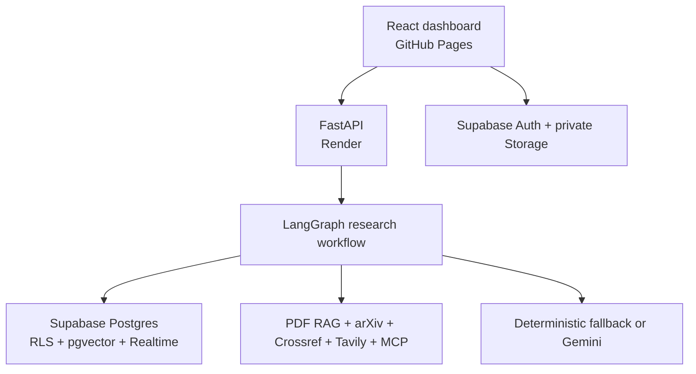
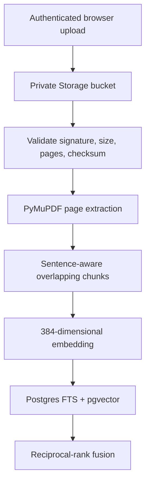

# EvidencePilot AI — Final Technical Documentation

**Owner:** Huzaifa Waqar Butt  
**Version:** 1.0.0  
**Supabase project:** `dsbxndbbpryisxevjjgc`  
**Repository:** <https://github.com/Huzaifa-170504/evidencepilot-ai>

## Product summary

EvidencePilot AI is an evidence-first research workspace. It accepts a research question and optional private PDFs, creates a bounded plan, conditionally routes specialist agents, records observable work, challenges weak conclusions, verifies material claims, and produces a referenced report with a claim-evidence matrix.

It is intentionally not a generic chatbot. Its main interface is a research project containing documents, runs, sources, claims, memories, reports, and engineering traces.

## Normal user journey

1. Open the dashboard and choose the cached recruiter demo or sign in with Supabase.
2. Create a research project.
3. Upload up to two PDFs for the public MVP; each is limited to 10 MB and 150 pages.
4. Enter a question and choose quick, standard, or deep scope.
5. Review the supervisor plan and selected agents.
6. Start the run and watch the safe event timeline.
7. Inspect sources, PDF pages, claims, verdicts, and limitations.
8. Export Markdown or use the print dialog to save a PDF.
9. Inspect or delete saved project memory.

Recruiters can use the versioned Mamba-YOLO snapshot even when Render, Supabase, Gemini, or Tavily is asleep or rate-limited.

## Architecture



The static frontend contains no trusted backend key. It may receive only the Supabase URL and publishable key. Service-role, Gemini, Tavily, and database credentials remain backend-only.

## Agents and training

EvidencePilot does **not** train a separate neural network for every agent. Each agent is a role around a pretrained model or deterministic fallback, with a typed contract, allowlisted tools, selected state, explicit budget, and stop condition.

| Agent | Purpose | Runs when |
|---|---|---|
| Supervisor | Decomposes the question and fixes the budget | Every full run |
| Academic Research | Maps papers and identifiers | Literature is relevant |
| Web Research | Finds current implementations | Current information is relevant |
| Document Research | Retrieves permission-filtered PDF chunks | Ready PDFs exist |
| Data Analyst | Handles bounded numeric analysis | Calculation is required |
| Critic | Finds gaps, contradictions, and weak methods | Every full report |
| Fact Checker | Assigns verdicts against stored source IDs | Every full report |
| Report | Writes only from the verified evidence ledger | Final stage |

RAG is not training. A PDF is parsed, chunked, embedded, stored, retrieved, and cited at request time. Fine-tuning is deferred until evaluation proves a repeated failure that prompting, tools, retrieval, or orchestration cannot solve.

## PDF ingestion and RAG



Controls include owner/project path validation, MIME and magic-byte validation, password-protected PDF rejection, checksum deduplication, filename sanitization, private Storage, RLS, and prompt-injection instructions that treat retrieved content as untrusted evidence.

The zero-cost hashing embedding provider keeps local retrieval usable without an external key. Gemini embeddings can replace it through the provider boundary for stronger semantic quality.

## Database

The connected Supabase project contains 16 application tables:

- Identity and workspaces: `profiles`, `projects`, `project_members`
- RAG: `documents`, `document_chunks`
- Execution: `research_runs`, `agent_tasks`, `agent_events`, `jobs`
- Evidence: `sources`, `findings`, `claims`, `claim_evidence`
- Interaction: `messages`, `memories`, `feedback`

The `research-documents` bucket is private and enforces PDF-only, 10 MB uploads. Every application table has RLS. Helper functions live in a non-exposed `private` schema. The Supabase security advisor reports no findings after hardening.

Reproducible schema files:

- `supabase/migrations/20260814190000_evidencepilot_foundation.sql`
- `supabase/migrations/20260814203000_security_advisor_hardening.sql`
- `supabase/seed/demo.sql`

## Function tools and MCP

Direct function tools are best for internal Python capabilities. MCP is used where a standardized, discoverable interface is valuable. The read-only `evidencepilot-research-tools` server exposes `search_project_documents`, `fetch_source`, `search_academic_metadata`, and `get_saved_project_findings`.

It accepts no raw SQL, arbitrary shell command, unrestricted filesystem path, or external write. It forwards a short-lived user access token so API authorization and RLS remain the boundary.

## API and frontend

FastAPI exposes OpenAPI at `/docs`. It includes health, demo, project CRUD, document registration/ingestion/deletion, research runs/events/claims/sources/reports/cancel/resume, hybrid document search, academic search, and memory routes.

The responsive React dashboard includes recruiter demo, Supabase authentication, project creation, direct private PDF upload, question/depth controls, agent timeline, source registry, claim matrix, Markdown and print/PDF export, memory controls, engineering/evaluation view, privacy settings, mobile navigation, focus states, and reduced-motion support.

## Free-tier operation

The code has no mandatory monthly subscription. The deployment uses GitHub Pages, Render free web service, Supabase free tier, optional Gemini free quota, optional Tavily free credits, and free arXiv/Crossref APIs.

Free services can sleep, pause, or exhaust quotas. EvidencePilot therefore labels and serves a cached public snapshot instead of pretending cached output is live.

## Local setup

Prerequisites: Python 3.12+, Node 20+, npm 10+, and `uv`.

```bash
git clone https://github.com/Huzaifa-170504/evidencepilot-ai.git
cd evidencepilot-ai
cp .env.example .env
make install
make dev
```

Open <http://localhost:5173>, <http://localhost:8000/docs>, and <http://localhost:8000/health>.

For Auth and uploads, copy the Supabase project URL and publishable key into public frontend and backend variables. Never place the service-role key in a `VITE_*` variable.

## Validation and evaluation

```bash
make lint
make test
make build
uv run --directory apps/api python ../../evals/runners/evaluate_contracts.py
```

The repository includes 25 evaluation questions covering document-only research, web, academic discovery, conflicting sources, insufficient evidence, routing, numeric analysis, and prompt injection.

The deterministic baseline enforces zero fabricated source IDs, correct conditional routing, Critic and Fact Checker before full reports, and stable recruiter-reproducible output. Provider-backed relevance metrics must be recorded separately after production keys and a licensed PDF answer corpus are configured.

## Deployment

### GitHub Pages

Set repository variables `VITE_API_BASE_URL`, `VITE_SUPABASE_URL`, and `VITE_SUPABASE_PUBLISHABLE_KEY`. In Settings → Pages, choose **GitHub Actions**. Merging to `main` runs `.github/workflows/pages.yml`.

### Render

Create a Blueprint from `render.yaml`. Add backend-only `SUPABASE_PUBLISHABLE_KEY`, `SUPABASE_SERVICE_ROLE_KEY`, and optional Gemini/Tavily keys. Point GitHub's `VITE_API_BASE_URL` variable to the Render URL and keep `FRONTEND_ORIGINS` equal to the Pages origin.

### Supabase Auth

In Authentication → URL Configuration, set the site URL to GitHub Pages and add localhost plus Pages to redirect URLs. Email/password Auth is sufficient for v1.

Supabase's “connect repository” option is optional here. The application connection is made through environment variables; migrations remain version-controlled and are already applied to the project.

## Remaining owner actions

Only account-level actions cannot be completed from source code alone:

1. Create/connect the Render web service and supply backend secrets.
2. Add the three public GitHub Actions variables.
3. Select GitHub Actions as the Pages source.
4. Add Supabase Auth site/redirect URLs after the final Pages URL exists.
5. Optionally create free Gemini/Tavily keys and enable live research after quota testing.

Everything else—application code, schema, RLS, Storage, pgvector, agents, RAG, MCP, tests, evaluation assets, CI/CD, and documentation—is version controlled.
