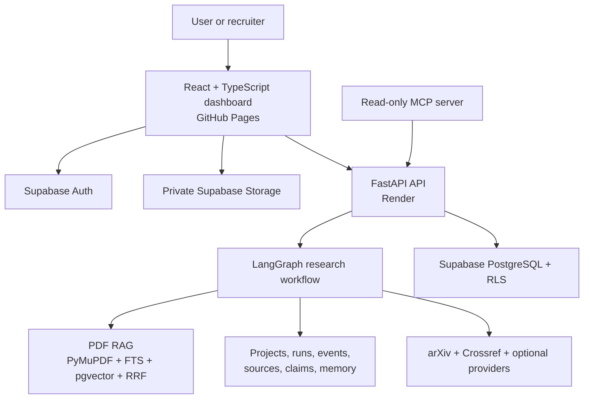

# EvidencePilot AI - Final Project Documentation

- **Project:** EvidencePilot AI - Agentic Research Intelligence Platform
- **Owner and developer:** **Huzaifa Waqar Butt**
- **Version:** 1.0.0
- **Finalization date:** 15 August 2026
- **Repository:** <https://github.com/Huzaifa-170504/evidencepilot-ai>
- **Frontend:** <https://huzaifa-170504.github.io/evidencepilot-ai/>
- **Backend:** <https://evidencepilot-ai.onrender.com>
- **Supabase project reference:** `dsbxndbbpryisxevjjgc`
- **License:** MIT

---

## 1. Executive summary

EvidencePilot AI is an evidence-first research workspace built by **Huzaifa Waqar Butt**. It is designed as a small AI research department rather than a general chatbot. A user creates a project, optionally uploads PDF evidence, asks a research question, observes a bounded multi-agent workflow, inspects sources and claim verdicts, and exports a referenced technical report.

The public release is recruiter-testable without a paid model subscription. Its deterministic Mamba-YOLO demonstration remains usable if Render or another free service is temporarily asleep. Authenticated users can create persistent Supabase projects and upload private PDFs after signing in.

EvidencePilot demonstrates:

- agentic planning and conditional LangGraph orchestration;
- academic, web, document, data-analysis, critic, fact-checking, and report contracts;
- PDF parsing, chunking, embeddings, hybrid retrieval, and page citations;
- Supabase Auth, PostgreSQL, pgvector, private Storage, Realtime, and Row Level Security;
- direct function tools and a read-only MCP server;
- memory, source and claim ledgers, observability events, and report export;
- FastAPI, React, TypeScript, CI/CD, security scanning, and free-tier deployment.

## 2. Live application

| Resource | URL | Purpose |
|---|---|---|
| Recruiter dashboard | <https://huzaifa-170504.github.io/evidencepilot-ai/> | Main user interface |
| API home | <https://evidencepilot-ai.onrender.com/> | Service status and endpoint links |
| API health | <https://evidencepilot-ai.onrender.com/health> | Render health check |
| API readiness | <https://evidencepilot-ai.onrender.com/ready> | Runtime dependency state |
| OpenAPI / Swagger | <https://evidencepilot-ai.onrender.com/docs> | Interactive API documentation |
| Source repository | <https://github.com/Huzaifa-170504/evidencepilot-ai> | Complete implementation |
| GitHub Actions | <https://github.com/Huzaifa-170504/evidencepilot-ai/actions> | CI, security, Pages, and smoke tests |

Render's free web service can require approximately one minute to wake after inactivity. The frontend displays the cached recruiter snapshot if the API is temporarily unavailable.

## 3. Product purpose

Traditional chatbots can return polished text without showing how a claim was produced. EvidencePilot instead keeps a source ledger and a claim-evidence matrix. Material claims must reference known source identifiers or remain visibly partial or unsupported.

Example question:

> Research the current state of Mamba architectures for object detection, compare major approaches, identify research gaps, and generate a referenced technical report.

EvidencePilot decomposes this into bounded specialist stages, records safe event summaries, challenges weak conclusions, verifies claims, and creates a report from the evidence ledger.

## 4. Normal user journey

### 4.1 Recruiter demo

1. Open the public frontend.
2. Select **Try the recruiter demo**.
3. Review the preloaded Mamba-YOLO research question.
4. Change the question or research depth and select **Start research**.
5. Confirm whether the header shows **API connected** or **Cached demo**.
6. Inspect the Supervisor plan and agent timeline.
7. Open **Sources** to inspect canonical evidence records.
8. Open **Claims** to review verified, partial, unsupported, or conflicting verdicts.
9. Open **Report** to read and export the referenced result.
10. Open **Engineering** to inspect the architecture and evaluation targets.

### 4.2 Authenticated PDF research

1. Create an account or sign in with email and password.
2. Select **New research** and enter a project name.
3. Open **Documents** and upload a non-sensitive PDF.
4. Wait until the document status is `ready`.
5. Ask a question that can be answered from the uploaded document.
6. Start the research run.
7. Verify that **Document Research** was selected.
8. Inspect PDF evidence showing the filename and page number.
9. Review claims, limitations, and the generated report.
10. Export Markdown or use **Print / PDF**.
11. Delete the document, project, or saved memory when no longer needed.

### 4.3 Upload limits

- PDF only;
- maximum 10 MB per file;
- maximum 150 pages;
- maximum two PDFs in the public MVP interface;
- password-protected PDFs are rejected;
- scanned pages with insufficient text are identified as possible scans;
- confidential, medical, legal, or classified documents must not be uploaded to the public demo.

## 5. System architecture



### Trust boundaries

- GitHub Pages is a static, untrusted browser client.
- The browser contains only public configuration: the Render URL, Supabase URL, and Supabase publishable key.
- The Supabase service-role key, database URL, Gemini key, and Tavily key remain backend-only.
- FastAPI validates access tokens before private operations.
- Supabase RLS remains the final row-authorization boundary.
- Retrieved PDF and web content is treated as untrusted evidence, never as agent instructions.

## 6. Agents and orchestration

| Agent | Responsibility | Selection rule |
|---|---|---|
| Supervisor | Defines scope, plan, dependencies, and fixed budget | Every full run |
| Academic Research | Maps papers and stable academic identifiers | Standard research workflow |
| Web Research | Records current implementation evidence | Standard research workflow |
| Document Research | Retrieves permission-filtered PDF chunks | Only when ready documents exist |
| Data Analyst | Records bounded numeric-analysis work | Only when numeric analysis is requested |
| Critic | Finds gaps, contradictions, and weak comparisons | Every full report |
| Fact Checker | Links material claims to stored source IDs | Every full report |
| Report | Writes the referenced final report | Final stage |

LangGraph stores typed state and enforces a visible sequence from Supervisor through critique, fact checking, and reporting. Document Research and Data Analyst are skipped when they are unnecessary.

### Are the agents trained separately?

No. EvidencePilot does not train eight different neural networks. Agents are role-specific workflows around pretrained models or a deterministic provider. Each has:

- a responsibility and typed input/output contract;
- selected state and an allowlisted capability set;
- budgets, stop conditions, and limited retries;
- safe event summaries and citation rules.

RAG is not training either. Uploading a PDF parses and indexes its contents for retrieval at request time. Fine-tuning is intentionally deferred until an evaluation dataset demonstrates a repeated problem that prompting, retrieval, tools, or orchestration cannot solve.

### Released provider mode

The public release uses the deterministic provider so recruiter testing is stable and free. Gemini, Tavily, arXiv, and Crossref adapters demonstrate replaceable provider boundaries. arXiv/Crossref metadata search is exposed through the authenticated API. Enabling broader provider-backed generation should be treated as a controlled extension and evaluated separately; the project never pretends cached output is a live provider result.

## 7. Technology stack and why each technology is used

| Area | Technology | Why it is used |
|---|---|---|
| Frontend | React 19 | Component-based interactive dashboard and stateful user workflows |
| Language | TypeScript | Compile-time contracts between UI, API responses, and Supabase data |
| Build tool | Vite | Fast development and optimized static assets for GitHub Pages |
| Icons | Lucide React | Accessible, consistent interface icons without custom image dependencies |
| Frontend SDK | Supabase JS | Authentication sessions and direct private Storage uploads |
| Backend language | Python 3.12 | Strong AI, document-processing, and data ecosystem |
| API framework | FastAPI | Typed REST endpoints, validation, CORS, dependency injection, and OpenAPI |
| Validation | Pydantic | Validated request/response contracts and environment settings |
| Server | Uvicorn | ASGI runtime used by the Render container |
| Orchestration | LangGraph | Explicit state graph, conditional stages, and observable agent transitions |
| PDF parsing | PyMuPDF | Fast page-aware extraction and page-count validation |
| PDF fallback | pypdf | Complementary PDF inspection support |
| Embeddings | Deterministic hashing / Gemini adapter | Zero-cost reproducible baseline with a replaceable semantic provider |
| Database | Supabase PostgreSQL | Durable projects, runs, sources, claims, events, jobs, and memory |
| Vector search | pgvector | Semantic similarity without a separate vector-database subscription |
| Keyword search | PostgreSQL full-text search | Exact-term retrieval for technical names and identifiers |
| Rank fusion | Reciprocal Rank Fusion | Combines semantic and keyword rankings |
| Authentication | Supabase Auth | Managed email/password sessions and signed JWTs |
| File storage | Private Supabase Storage | Owner-scoped PDF bytes outside database rows |
| Live updates | Supabase Realtime | Supports run/event updates with API polling fallback |
| Academic tools | arXiv API and Crossref REST API | Free paper discovery, DOI, author, and publication metadata |
| Web provider | Tavily adapter | Optional bounded current-web search |
| LLM provider | Gemini adapter | Optional structured generation behind a provider interface |
| Standardized tools | MCP Python SDK / FastMCP | Read-only discoverable project research tools |
| Frontend hosting | GitHub Pages | Free static hosting integrated with the public repository |
| Backend hosting | Render Docker web service | Public Python/FastAPI execution on a free instance |
| CI/CD | GitHub Actions | Reproducible linting, tests, audits, Pages deployment, and smoke tests |
| Testing | pytest, Vitest, Testing Library | Backend, orchestration, RAG, security, and UI behavior |
| Quality | Ruff and ESLint | Consistent Python and TypeScript code quality |
| Dependency security | npm audit and pip-audit | Detects known vulnerable dependencies |

## 8. PDF ingestion and RAG

```mermaid
flowchart LR
    U["Authenticated PDF upload"] --> S["Private Storage"]
    S --> V["Signature, size, encryption,<br/>page, and checksum validation"]
    V --> P["Page-aware PyMuPDF extraction"]
    P --> C["Overlapping sentence-aware chunks"]
    C --> E["384-dimensional embeddings"]
    E --> H["Postgres FTS + pgvector"]
    H --> R["Reciprocal-rank fusion"]
    R --> A["Document Research agent"]
    A --> Q["Filename + page citation"]
```



Every stored chunk retains document ID, project ID, owner ID, page number, offsets, content, metadata, and embedding. The hybrid search function applies the project filter inside PostgreSQL before ranking results. The model sees only permission-filtered evidence.

## 9. Database and Supabase verification

The production Supabase project was inspected during finalization:

| Check | Verified result |
|---|---|
| Project health | `ACTIVE_HEALTHY` |
| PostgreSQL | Version 17 |
| Application tables | 16 |
| Tables with RLS | 16 of 16 |
| Public-schema policies | 46 |
| Authenticated table grants | Present |
| pgvector | Enabled |
| Private PDF bucket | Present, private, PDF-only, 10 MB |
| Realtime tables | `research_runs` and `agent_events` |
| Applied migrations | Foundation, security hardening, storage path hardening |
| Security advisor | No findings |

### Application tables

- Identity and workspaces: `profiles`, `projects`, `project_members`
- Documents and RAG: `documents`, `document_chunks`
- Runs and observability: `research_runs`, `agent_tasks`, `agent_events`, `jobs`
- Evidence: `sources`, `findings`, `claims`, `claim_evidence`
- Interaction and control: `messages`, `memories`, `feedback`

Performance-advisor "unused index" notices are informational for the new demo database and should not cause indexes to be removed before representative traffic exists.

## 10. API

### Public operational routes

- `GET /` - service information and endpoint links
- `GET /health` - liveness
- `GET /ready` - configured runtime dependencies
- `GET /docs` - Swagger UI
- `GET /api/v1/demo` - completed recruiter snapshot
- `POST /api/v1/research/demo` - bounded deterministic public run

### Protected workspace routes

- project create, list, read, update, and delete;
- document register, ingest, inspect, search, and delete;
- research run create, inspect, cancel, resume, events, sources, claims, and report;
- project memory list and delete;
- academic metadata search.

OpenAPI is the authoritative machine-readable contract for exact paths and schemas.

## 11. Function tools and MCP

Direct Python functions are used when the capability belongs only to the API process. MCP is used to expose a small standardized, reusable, read-only tool surface.

The `evidencepilot-research-tools` MCP server exposes:

- `search_project_documents`
- `fetch_source`
- `search_academic_metadata`
- `get_saved_project_findings`

It accepts an EvidencePilot API URL and short-lived user access token. It never exposes raw SQL, arbitrary shell commands, unrestricted filesystem access, arbitrary URLs, or external writes. API authentication and Supabase RLS remain authoritative.

The MCP server is an operator/developer demonstration and is not required for the public browser demo.

## 12. Security and privacy

- No secret or service-role credential is committed or bundled into the frontend.
- The bundled Supabase key is a deliberately public publishable client key.
- Every exposed application table has RLS.
- Storage paths begin with authenticated user ID and project ID.
- Upload metadata and path ownership are checked by both the API and Storage policies.
- PDF magic bytes, size, encryption, page count, filename, and checksum are validated.
- Prompt-injection guidance treats retrieved content as evidence, not instruction.
- Agents cannot access raw SQL, shell, or unrestricted filesystem tools.
- CORS allows the approved GitHub Pages origin and local development origin only.
- Rate limits protect demo research runs.
- Logs and UI events contain safe summaries, not private chain-of-thought.
- Users can delete projects, documents, and saved memory.

## 13. Local setup

### Prerequisites

- Git
- Python 3.12+
- Node.js 20+ and npm 10+
- `uv`

### Clone on Windows into the requested location

Open PowerShell:

```powershell
New-Item -ItemType Directory -Force "D:\My Projects" | Out-Null
Set-Location "D:\My Projects"
git clone https://github.com/Huzaifa-170504/evidencepilot-ai.git
Set-Location "D:\My Projects\evidencepilot-ai"
```

If the folder already exists:

```powershell
Set-Location "D:\My Projects\evidencepilot-ai"
git switch main
git pull --ff-only origin main
```

### Install and run

```powershell
Copy-Item .env.example .env
uv sync --directory apps/api --all-groups --frozen
npm ci
npm run dev
```

Open:

- <http://localhost:5173>
- <http://localhost:8000/>
- <http://localhost:8000/health>
- <http://localhost:8000/docs>

The local frontend intentionally requires local `.env` values for Supabase. Production public defaults are used only in production builds.

## 14. Testing and validation

Run:

```bash
make lint
make test
make build
uv run --directory apps/api python ../../evals/runners/evaluate_contracts.py
```

The automated suite covers:

- API health, readiness, and root links;
- authentication requirements and cross-workspace ownership behavior;
- project CRUD;
- PDF upload validation, page parsing, chunking, embeddings, and retrieval;
- document-grounded research with page sources;
- conditional agent routing;
- citation/source integrity;
- cancel/resume and report download;
- frontend dashboard rendering;
- TypeScript and Python linting;
- production frontend build;
- npm and Python dependency audits;
- 25 version-controlled evaluation questions.

The `Deployment smoke test` workflow wakes and verifies the public Render service, CORS, readiness, demo API, Swagger UI, and GitHub Pages after deployment.

## 15. Requirements completion matrix

| Requirement | Release status | Evidence |
|---|---|---|
| Public recruiter dashboard | Complete | GitHub Pages workflow and live URL |
| FastAPI backend and OpenAPI | Complete | Render URL, root, health, readiness, docs |
| Supervisor and specialist graph | Complete | LangGraph state graph and orchestration tests |
| Conditional Document/Data Analyst routing | Complete | Routing logic and evaluation dataset |
| Critic, Fact Checker, and Report stages | Complete | Graph, claims, reports, contract tests |
| PDF upload and page-aware parsing | Complete | Private Storage flow, PyMuPDF, validation tests |
| Embeddings and hybrid retrieval | Complete | Hashing provider, pgvector, FTS, RRF |
| Stable citations and claim ledger | Complete | Source IDs, claims table, evaluation checks |
| Supabase Auth/Postgres/Storage/Realtime | Complete | Live project audit and migrations |
| RLS and storage ownership | Complete | 16/16 RLS tables, policies, security advisor |
| Project memory controls | Complete | Memory list/delete API and UI |
| Function tools | Complete | Document and academic tool routes |
| Read-only MCP demonstration | Complete | FastMCP server with four allowlisted tools |
| Configurable live providers | Adapter complete | Gemini/Tavily adapters exist; public release remains deterministic |
| Evaluation and CI/CD | Complete | CI, security, Pages, smoke workflows |
| Free-tier deployment | Complete within quotas | GitHub Pages, Render free service, Supabase free tier |
| Windows reproducibility | Complete | PowerShell clone and setup instructions |

## 16. Known limitations

- Render free instances sleep and require a cold start.
- The public workflow is deterministic for stable, zero-cost recruiter testing.
- Provider-backed web/LLM research requires additional controlled integration and evaluation before being presented as production evidence.
- OCR for scanned PDFs is not included in version 1.
- The authenticated production PDF flow depends on correct Supabase Auth URL configuration and the backend service-role key.
- Full production load, accessibility, and multi-user penetration testing should be repeated before handling real confidential data.
- EvidencePilot assists research; it is not a legally authoritative fact-checking system.

## 17. Free-tier operation

No paid subscription is required for the released recruiter demo while usage remains within provider quotas:

- GitHub Pages hosts the static frontend.
- Render hosts the Dockerized FastAPI API on a free instance.
- Supabase provides Auth, PostgreSQL, Storage, Realtime, and pgvector.
- Deterministic workflow output avoids mandatory LLM cost.
- arXiv and Crossref provide free academic metadata access.

Free providers can change quotas or pause inactive services. The cached snapshot and provider interfaces limit that operational risk.

## 18. Repository map

```text
evidencepilot-ai/
|-- apps/api/                      FastAPI, LangGraph, PDF RAG, tests
|-- apps/web/                      React/TypeScript recruiter dashboard
|-- packages/mcp_server/           Read-only FastMCP server
|-- packages/agents|rag|tools/     Extractable package boundaries
|-- supabase/migrations/           Schema, pgvector, RLS, Storage
|-- supabase/seed/                 Public Mamba-YOLO demo records
|-- evals/                         Dataset, runner, baseline results
|-- scripts/                       Public deployment verification
|-- docs/                          Architecture and operations guides
|-- .github/workflows/             CI, security, Pages, smoke tests
|-- render.yaml                    Render Blueprint
|-- PROJECT_REQUIREMENTS.md        Original approved requirements
|-- FINAL_DOCUMENTATION.md         This final reference
`-- README.md                     Recruiter entry point
```

## 19. Recruiter evaluation checklist

A recruiter can:

1. open the public dashboard without installing anything;
2. run or inspect the Mamba-YOLO demonstration;
3. observe Supervisor and specialist transitions;
4. inspect source records, claims, verdicts, and limitations;
5. export the report;
6. inspect engineering and evaluation information;
7. open Swagger UI;
8. inspect the public repository and security design;
9. reproduce the application locally;
10. verify CI, dependency audits, deployment, and smoke-test history.

## 20. Ownership

EvidencePilot AI was designed and developed as a portfolio and learning project by **Huzaifa Waqar Butt**. The repository is released under the MIT License. Contributions should preserve the evidence-first rule: no material claim may be promoted without a resolvable stored source, and unsupported evidence must remain visible.

## 21. Final handoff summary

| Component | Final state |
|---|---|
| Frontend | Public GitHub Pages deployment |
| Backend | Public Dockerized FastAPI service on Render |
| Data platform | Healthy Supabase project with migrations and RLS |
| Public mode | Free deterministic recruiter workflow with cached fallback |
| Documentation | README, technical reference, deployment guide, usage guide, and changelog |
| Validation | CI, security audit, Pages deployment, and scheduled smoke workflow |
| Ownership | Huzaifa Waqar Butt |

The only step that must be completed on Huzaifa's own computer is cloning or updating the repository at `D:\My Projects\evidencepilot-ai`. The exact PowerShell commands are provided in Section 13.
