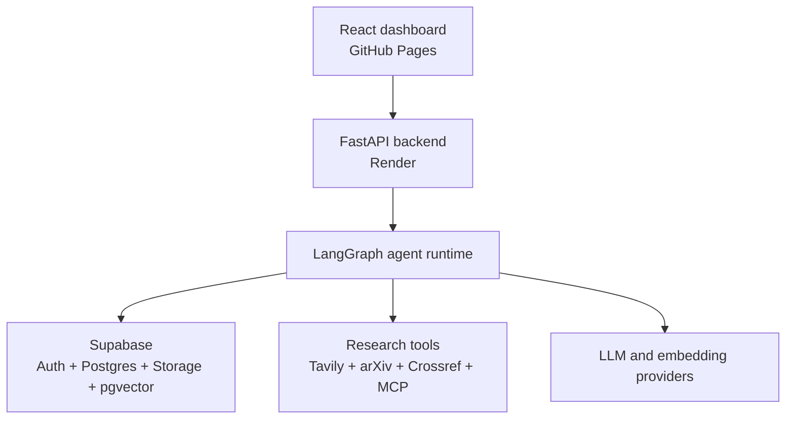
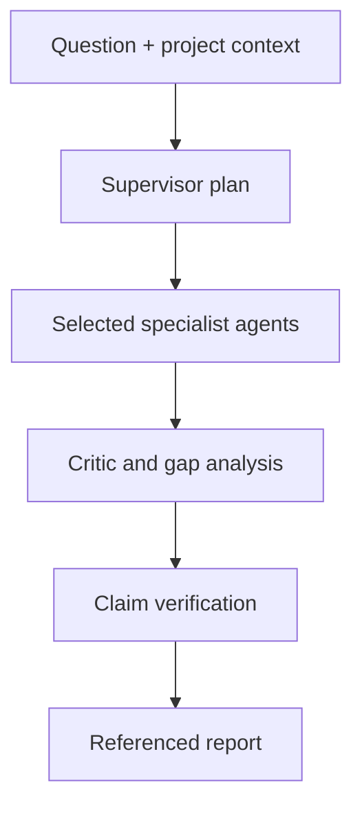
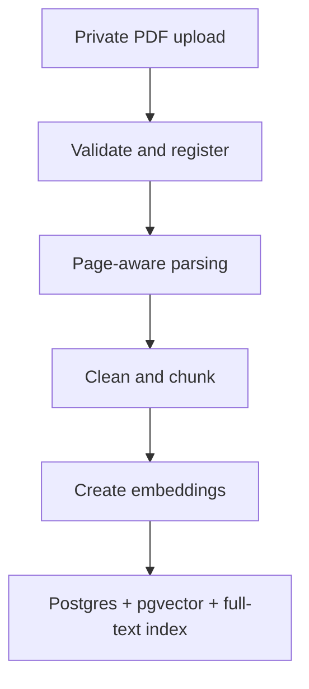

# EvidencePilot AI

## Agentic Research Intelligence Platform — Product and Technical Requirements

**Owner:** Huzaifa Waqar Butt
**Recommended repository:** `evidencepilot-ai`
**Recommended public title:** **EvidencePilot AI — Agentic Research Intelligence Platform**
**Tagline:** *Evidence-first research by coordinated AI agents.*
**Specification date:** 14 August 2026

---

## 1. Executive Decision

EvidencePilot AI will be a research workspace, not a generic chatbot. A user creates a research project, uploads reference documents, asks a research question, reviews the plan, watches specialist agents work, inspects sources and claim verification, and exports a referenced report.

The first release will be a portfolio-sized public demo that costs **$0 per month within free-tier quotas**. It will use:

| Layer | Selected technology | Purpose |
|---|---|---|
| Frontend | React, TypeScript, Vite, Tailwind CSS, shadcn/ui | Responsive research dashboard |
| Frontend hosting | GitHub Pages | Static application hosting |
| Backend | Python 3.12, FastAPI, Pydantic | API, agent runtime, PDF processing |
| Agent orchestration | LangGraph | Supervisor and specialist workflow graph |
| Backend hosting | Render free web service | Public Python API; may sleep when idle |
| Authentication | Supabase Auth | Email and guest/demo identities |
| Database | Supabase PostgreSQL | Projects, runs, sources, claims, events, memory |
| Vector database | Supabase PostgreSQL + pgvector | Semantic retrieval over document chunks |
| File storage | Private Supabase Storage bucket | User-uploaded PDFs and derived files |
| Live updates | Supabase Realtime plus API polling fallback | Agent progress timeline |
| Primary LLM | Configurable Gemini free-tier model | Planning, synthesis, critique, reporting |
| Embeddings | Configurable Gemini embeddings for MVP | Document and memory vectors |
| Web research | Tavily free tier | Current web search and extraction |
| Academic research | arXiv API and Crossref REST API | Paper discovery and metadata |
| MCP | Python MCP SDK/FastMCP plus allowlisted tools | Standardized external capability access |
| CI/CD | GitHub Actions | Tests, linting, frontend deployment |
| Observability | Structured logs, agent events, run metrics | Debugging and recruiter-visible traces |

The provider layer must remain replaceable. LLM, embedding, search, and storage providers will be accessed through interfaces rather than imported directly throughout the codebase.

---

## 2. Product Goals

### 2.1 Primary goal

Turn a complex research question and optional user documents into a traceable, evidence-backed technical report using coordinated agents, RAG, tools/APIs, MCP, vector retrieval, project memory, and a professional dashboard.

### 2.2 Portfolio goal

A recruiter should be able to open a public URL, use a preloaded example, run a small live research task, inspect the agent workflow, open evidence for claims, and view the complete GitHub implementation without needing a paid account.

### 2.3 Learning goal

The repository must clearly demonstrate:

- LLM integration and structured outputs.
- Function/tool calling.
- Multi-agent orchestration.
- MCP client and server usage.
- PDF ingestion and RAG.
- Embeddings and vector search.
- Hybrid retrieval and reranking.
- Short-term, project, and user-preference memory.
- Authentication, database design, secure uploads, and Row Level Security.
- Evaluation, observability, CI/CD, and deployment.

### 2.4 Non-goals for version 1

- Training a foundation model from scratch.
- Unlimited public usage.
- A legally authoritative fact-checking system.
- Full collaborative editing by multiple organizations.
- Processing confidential, medical, legal, or classified documents in the public demo.
- Autonomous write access to arbitrary external accounts.

---

## 3. Normal User Experience

### 3.1 New user journey

1. The user opens the public GitHub Pages application.
2. The application wakes the backend if it is sleeping and shows a clear progress message.
3. The user chooses **Try Demo**, signs in, or creates an account.
4. The user creates a project such as **Mamba Architectures for Object Detection**.
5. The user optionally uploads PDF papers and enters a research question.
6. The user selects scope: quick brief, standard research, or deep research.
7. The Supervisor proposes a plan showing subquestions, selected agents, tool budget, and expected outputs.
8. The user starts the run. Approval will be required later for any tool capable of external writes; version 1 tools are read-only.
9. A live timeline shows planning, searching, document retrieval, critique, verification, and report generation.
10. The user can inspect source cards and open the precise supporting PDF page or web URL.
11. The final workspace shows the report, claim-evidence matrix, contradictions, limitations, and run metrics.
12. The user exports Markdown or PDF and can ask follow-up questions within the same project context.

### 3.2 Recruiter demo journey

- No setup is required.
- A preloaded Mamba-YOLO project is immediately available.
- One small live run is allowed under strict quotas.
- A cached completed report remains available if a free API quota is temporarily exhausted.
- The interface labels cached output as a demo snapshot; it never pretends that a cached run is live.
- Architecture, traces, evaluation results, API documentation, and GitHub links are visible from an **Engineering** page.

---

## 4. System Architecture



### 4.1 Important boundary

GitHub Pages serves only static HTML, CSS, and JavaScript. It must never contain private API keys, the Supabase service-role key, LLM secrets, search secrets, or trusted agent logic. The browser calls the FastAPI backend over HTTPS. Only the public Supabase anonymous key may appear in the frontend, protected by Row Level Security.

### 4.2 Research execution flow



The Supervisor uses specialists as bounded tools and owns the final workflow. It does not hand the user conversation permanently to each specialist.

---

## 5. Agent Requirements

### 5.1 Core principle

Do **not** start by creating eight independent agents. Start with one research agent plus tools, establish evaluation baselines, and split a capability into a specialist only when it needs distinct instructions, tools, policies, or output contracts.

### 5.2 Version 1 agent contracts

| Agent | Responsibility | Inputs | Structured output |
|---|---|---|---|
| Supervisor | Decompose the question, select agents/tools, control budget, merge state | Question, project memory, available documents | Research plan, tasks, dependencies, completion criteria |
| Web Research | Find current trustworthy web sources | Assigned subquestion, date scope | Findings, URLs, excerpts, source quality, uncertainties |
| Academic Research | Find papers and scholarly metadata | Assigned subquestion, keywords | Papers, DOI/arXiv IDs, abstracts, relevance, limitations |
| Document Research | Retrieve evidence from uploaded documents | Query, project/vector-store filters | Chunks, page numbers, excerpts, relevance scores |
| Data Analyst | Analyze CSV or extracted numeric data when needed | Dataset/tool request | Method, code/output summary, tables, caveats |
| Critic | Challenge coverage, methods, contradictions, and missing evidence | All candidate findings | Weaknesses, counterarguments, missing searches |
| Fact Checker | Verify material claims against evidence | Claims and cited evidence | Verified/partial/unsupported/conflicting verdicts |
| Report | Produce the final deliverable without inventing citations | Verified findings and report preferences | Sections, inline citations, bibliography, limitations |

### 5.3 Conditional routing

Not every run invokes every agent.

- No uploaded documents: skip Document Research.
- No numeric dataset or calculation request: skip Data Analyst.
- Simple follow-up: use retrieval plus a single synthesis call.
- Current-state question: prioritize Web Research.
- Literature review: prioritize Academic and Document Research.
- All full reports: run Critic and Fact Checker before Report.

### 5.4 Agent budgets

Each run must define maximum model calls, maximum search calls, maximum sources, maximum wall time, and maximum retries. The Supervisor cannot increase these limits. The public demo defaults to a small budget.

### 5.5 Are the agents trained?

No model training is required for the initial project. Each agent uses a pretrained LLM configured with:

- A role-specific system instruction.
- An allowlisted tool set.
- A typed input/output schema.
- Access to selected state and memory.
- Stop conditions, budgets, and guardrails.

RAG is also not model training. Uploading a PDF causes the system to parse, chunk, embed, store, and retrieve its content at request time. Fine-tuning should be considered only after a meaningful evaluation dataset shows a repeated failure that prompt, tool, retrieval, or workflow changes do not fix.

---

## 6. PDF Upload and RAG Requirements

### 6.1 Upload design

- Store PDF bytes in a private Supabase Storage bucket named `research-documents`.
- Store metadata and processing state in PostgreSQL.
- Upload directly from the browser using the authenticated Supabase client or a short-lived signed upload URL.
- Never proxy large PDF bytes through a serverless frontend function.
- Version 1 public-demo limit: two PDFs per run, 10 MB per file, and 150 pages per PDF.
- Authenticated development limit: configurable up to the provider's free-tier file limit.

### 6.2 Security validation

The backend must verify:

- Authenticated ownership of the project.
- File extension, reported MIME type, and file magic bytes.
- Maximum size and page count.
- SHA-256 checksum for deduplication.
- PDF parser success and encrypted/password-protected status.
- Sanitized filenames and generated storage paths.
- No active content is rendered directly in the application.

Uploaded text is untrusted evidence, not an instruction to the agent. Prompts must explicitly ignore instructions found inside documents and webpages.

### 6.3 Ingestion pipeline



### 6.4 Parsing and chunking

- Use PyMuPDF for fast page-aware extraction.
- Fall back to pypdf where useful.
- Detect pages with insufficient text and mark them as possible scans.
- OCR is a phase-2 feature because it increases memory and deployment cost.
- Preserve document ID, filename, page number, section heading, and character offsets with each chunk.
- Initial target: 700–1,000 tokens per chunk with 100–150 token overlap.
- Do not split tables, references, headings, or sentences blindly when layout signals are available.

### 6.5 Retrieval

Hybrid retrieval combines:

1. PostgreSQL full-text keyword search.
2. pgvector semantic similarity.
3. Reciprocal Rank Fusion or normalized score fusion.
4. Optional cross-encoder reranking in phase 2.
5. Project and document permission filters before results reach the model.

Every returned chunk must retain a stable citation target: document ID, filename, page, chunk ID, excerpt, and retrieval score.

### 6.6 Citation behavior

- Claims from uploads cite filename and page.
- Web claims cite the canonical URL and access date.
- Academic sources show title, authors, year, DOI/arXiv ID, and URL where available.
- A generated citation must correspond to a stored source record.
- The application must never allow the LLM to invent an unseen source identifier.

---

## 7. Database Requirements

### 7.1 Why the database is needed

File storage contains raw PDFs. PostgreSQL contains structured state: users, projects, uploads, agent work, sources, claims, citations, reports, feedback, and memory. pgvector adds semantic search without requiring a separate vector-database subscription.

### 7.2 Required tables

| Table | Key purpose |
|---|---|
| `profiles` | User profile and report preferences |
| `projects` | Research workspaces owned by users |
| `project_members` | Future collaboration and roles |
| `documents` | File metadata, checksum, parsing status, storage path |
| `document_chunks` | Page-aware text, full-text column, vector embedding |
| `research_runs` | Question, plan, status, budgets, final output, metrics |
| `agent_tasks` | Per-agent inputs, outputs, dependencies, timing, errors |
| `agent_events` | Recruiter-visible progress and observability timeline |
| `sources` | Canonical web, academic, document, and dataset records |
| `findings` | Normalized evidence extracted by specialist agents |
| `claims` | Material statements considered for the report |
| `claim_evidence` | Supports/contradicts relationship between claims and evidence |
| `messages` | Project follow-up conversation history |
| `memories` | User/project preferences and reusable findings |
| `jobs` | Resumable ingestion and research work queue |
| `feedback` | User rating, comments, and evaluation labels |

### 7.3 Row Level Security

- A user can read and modify only projects they own or are explicitly assigned to.
- Document chunks inherit access from their document and project.
- Storage paths begin with the authenticated user ID and project ID.
- Public demo data is read-only except for isolated guest runs.
- The backend service-role key exists only in backend environment variables.
- Raw SQL is never exposed as an unrestricted LLM tool.

### 7.4 Memory model

| Memory type | Contents | Lifetime |
|---|---|---|
| Run state | Current plan, tasks, intermediate findings | One research run |
| Conversation memory | Recent follow-up messages and summarized context | One project |
| Project memory | Saved findings, sources, terminology, decisions | Until user deletes project |
| Preference memory | Report tone, depth, citation style | User controlled |

Users must be able to inspect, edit, disable, and delete saved long-term memory. Agent scratch reasoning is not stored or displayed; the platform stores concise decisions, tool events, outputs, and rationale summaries.

---

## 8. MCP and Tool Requirements

### 8.1 Function tools versus MCP

- Use a normal function tool when a capability belongs only to this backend and a direct Python call is simplest.
- Use MCP when the capability should be discoverable and reusable through a standardized server interface by different agents or clients.

### 8.2 Initial function tools

- `search_web`
- `extract_web_page`
- `search_arxiv`
- `search_crossref`
- `search_project_documents`
- `fetch_document_chunk`
- `save_source`
- `save_finding`
- `get_project_memory`
- `run_safe_python_analysis`

### 8.3 Initial MCP demonstration server

Create a read-only MCP server called `evidencepilot-research-tools` that exposes a small, meaningful subset:

- `search_project_documents`
- `fetch_source`
- `search_academic_metadata`
- `get_saved_project_findings`

The agent runtime acts as an MCP client. Tool names are allowlisted, arguments are schema-validated, outputs are logged, and write-capable tools are excluded from the public demo.

### 8.4 MCP security

- Prefer official MCP servers when external ones are added.
- Require explicit approval for external write actions.
- Log the data shared with MCP servers.
- Restrict tools with allowlists.
- Treat tool output and retrieved webpages as untrusted content.
- Apply timeouts, output-size limits, domain allowlists, and retry limits.

---

## 9. Functional Requirements

### 9.1 MVP requirements

| ID | Requirement |
|---|---|
| FR-01 | User can enter the application through guest demo or Supabase Auth. |
| FR-02 | User can create, open, rename, and delete a research project. |
| FR-03 | User can upload, list, process, and delete PDF documents. |
| FR-04 | System displays upload and ingestion status with actionable errors. |
| FR-05 | User can ask a scoped research question and choose report depth. |
| FR-06 | Supervisor produces a visible structured research plan. |
| FR-07 | Selected agents execute under fixed budgets and persist progress. |
| FR-08 | Dashboard displays agent states, source count, paper count, and elapsed time. |
| FR-09 | System retrieves uploaded content using hybrid RAG with page citations. |
| FR-10 | System discovers web and scholarly sources through tools/APIs. |
| FR-11 | Critic identifies missing evidence, contradictions, and methodological weaknesses. |
| FR-12 | Fact Checker assigns a verdict and evidence coverage to material claims. |
| FR-13 | Report includes inline citations, bibliography, limitations, and claim-evidence matrix. |
| FR-14 | User can open the evidence associated with each citation. |
| FR-15 | User can ask project-aware follow-up questions. |
| FR-16 | User can export Markdown; PDF export is included before public release. |
| FR-17 | User can view and delete project memory. |
| FR-18 | Public demo enforces per-user/IP quotas and safe file limits. |
| FR-19 | Failed or interrupted jobs can resume from the latest persisted task. |
| FR-20 | Engineering page presents architecture, model/provider configuration, traces, and evaluation results. |

### 9.2 Phase-2 requirements

- CSV/XLSX uploads and sandboxed data analysis.
- OCR for scanned PDFs.
- Zotero and Google Drive ingestion through approved connectors/MCP.
- Research graph visualization linking questions, findings, sources, and claims.
- Team project sharing.
- Multiple citation styles.
- Optional user-provided API keys stored securely outside the frontend.
- Streaming report sections and richer source comparison tables.

---

## 10. UI Requirements

### 10.1 Pages

- Landing and public demo.
- Authentication.
- Projects dashboard.
- New research wizard.
- Research workspace.
- Documents library.
- Sources and bibliography.
- Claim-evidence matrix.
- Memory controls.
- Final report and export.
- Engineering/evaluation page.
- Settings and privacy.

### 10.2 Research workspace layout

- Left sidebar: projects, history, documents, sources, memory.
- Main header: project title, question, status, mode, stop button.
- Agent activity panel: queued, running, completed, failed, retrying.
- Research plan: tasks and dependencies.
- Main content tabs: findings, sources, claims, report.
- Citation drawer: excerpt, source metadata, page/URL, supporting or contradicting status.
- Metrics: total duration, model calls, tool calls, retrieved chunks, sources, citation coverage.

### 10.3 Accessibility and responsiveness

- Keyboard navigable controls.
- Visible focus states.
- WCAG-friendly color contrast.
- Semantic headings and labels.
- Mobile layout for reading reports and viewing progress.
- Desktop-first workspace for deeper research interaction.

---

## 11. API Requirements

Initial REST endpoints:

- `GET /health`
- `POST /projects`
- `GET /projects`
- `GET /projects/{project_id}`
- `PATCH /projects/{project_id}`
- `DELETE /projects/{project_id}`
- `POST /projects/{project_id}/documents`
- `POST /documents/{document_id}/ingest`
- `GET /documents/{document_id}`
- `DELETE /documents/{document_id}`
- `POST /projects/{project_id}/runs`
- `GET /runs/{run_id}`
- `GET /runs/{run_id}/events`
- `POST /runs/{run_id}/cancel`
- `POST /runs/{run_id}/resume`
- `GET /runs/{run_id}/claims`
- `GET /runs/{run_id}/sources`
- `GET /runs/{run_id}/report`
- `POST /projects/{project_id}/messages`
- `GET /projects/{project_id}/memories`
- `DELETE /memories/{memory_id}`

The backend validates the Supabase JWT for protected routes. All request and response bodies use Pydantic schemas. OpenAPI documentation is available from the deployed FastAPI service.

---

## 12. Non-Functional Requirements

### 12.1 Reliability

- Every run and agent task has a persisted status.
- Tool calls are idempotent where practical.
- Duplicate uploads and canonical URLs are deduplicated.
- Failed tools return structured errors rather than fabricated results.
- A run can be cancelled and can resume after backend restart.

### 12.2 Performance targets for the public demo

- Cached demo project loads in under 3 seconds after frontend load.
- Backend wake-up state is communicated and retried for up to 90 seconds.
- PDF ingestion for a normal text PDF completes in under 60 seconds when backend is warm.
- Standard research run targets under 5 minutes and hard-stops before 8 minutes.
- Agent progress appears within 5 seconds through Realtime or polling.

### 12.3 Security

- No secrets committed to GitHub or embedded in frontend bundles.
- Environment variables are configured separately in Render, Supabase, and GitHub Actions.
- CORS permits only localhost during development and approved production origins.
- Rate limiting and quotas apply to authentication, uploads, search, and research runs.
- Prompt-injection defenses distinguish trusted instructions from untrusted evidence.
- HTML is sanitized before display.
- SQL uses parameterized queries and Row Level Security.
- Python analysis runs in a restricted environment with time, memory, package, network, and output limits.
- Dependencies and container images are scanned before release.

### 12.4 Privacy

- Public demo warns users to upload only public or non-sensitive documents.
- The selected free LLM provider's data-use implications are disclosed.
- Users can delete documents, project data, reports, and long-term memory.
- Logs exclude raw document text, authentication tokens, and API keys.

### 12.5 Observability

Store and display:

- Run ID and correlation ID.
- Agent transitions.
- Tool name, duration, result status, and safe summary.
- Retrieval queries and selected chunk IDs.
- Model/provider name, latency, and token estimates when available.
- Citation coverage and fact-check verdict counts.
- Errors and retry reasons.

Do not expose private chain-of-thought. Show concise action summaries and decision rationales.

---

## 13. Evaluation and Testing Requirements

### 13.1 Test layers

- Unit tests for parsers, chunking, schemas, score fusion, URL canonicalization, and budgets.
- Integration tests for Supabase, storage, pgvector, search adapters, and MCP tools.
- Agent contract tests using mocked model outputs.
- RAG tests using a small licensed/public PDF corpus with answer keys.
- End-to-end tests for create project, upload, run, inspect citation, and export.
- Security tests for ownership, malicious filenames, MIME spoofing, prompt injection, and rate limits.

### 13.2 Evaluation dataset

Create at least 25 version-controlled evaluation questions across:

- Uploaded-document-only questions.
- Current web research.
- Academic literature discovery.
- Conflicting sources.
- Insufficient evidence.
- Questions that do and do not need Data Analyst.

### 13.3 Initial release thresholds

- Zero fabricated citation IDs in the evaluation set.
- At least 90% of material report claims linked to stored evidence.
- At least 80% retrieval hit rate in the top five results for document-grounded questions.
- 100% denial of cross-user project/document access tests.
- The Supervisor correctly skips unnecessary agents in at least 90% of routing cases.
- Every unsupported claim is removed or visibly labeled before the final report.

---

## 14. Free-Tier and Recruiter-Testability Plan

### 14.1 Can the project avoid subscriptions?

Yes for a portfolio demo, but not for unlimited production traffic. The design has no required monthly subscription while usage stays inside current free quotas. Free services can sleep, pause, change quotas, or temporarily exhaust API limits.

### 14.2 Chosen free-tier behavior

| Service | Free-tier use | Expected limitation and mitigation |
|---|---|---|
| GitHub Pages | Frontend hosting | Static only; backend is separate |
| Render | FastAPI backend | Sleeps after inactivity; UI wakes and retries |
| Supabase | Auth, 500 MB database, 1 GB file storage, pgvector | May pause after inactivity; demo keeps a cached read-only project |
| Gemini API | LLM and initial embeddings | Rate-limited; provider adapter and cached demo fallback |
| Tavily | 1,000 free credits/month | Strict per-run search budget and caching |
| arXiv/Crossref | Academic metadata | Respect provider etiquette and rate limits |

### 14.3 Why not Firebase Storage for strict zero-billing setup?

As of 3 February 2026, Cloud Storage for Firebase requires the Blaze pay-as-you-go plan and a linked billing account. Firestore still has a no-cost quota, but using Firebase plus a separate vector database would add complexity. Supabase combines PostgreSQL, pgvector, Auth, Storage, Realtime, and Row Level Security in one free-tier platform, so it is the recommended choice.

### 14.4 Demo abuse controls

- Guest: one live run per day per identity/IP.
- Maximum two PDFs and 10 MB per file.
- Maximum 10 web results and 10 academic results.
- Maximum five model stages and fixed retry count.
- Cache normalized repeated questions.
- CAPTCHA can be added if abuse appears.
- Admin kill switch disables live public runs while leaving the cached demo available.

---

## 15. ChatGPT Plugin Recommendations

ChatGPT plugins help build or operate the project; they do not automatically become dependencies inside the deployed application.

### Required for our build workflow

1. **GitHub** — already available for repository work, commits, branches, issues, and pull requests.
2. **Supabase** — install/connect this before the database, Auth, Storage, and pgvector implementation phase.

### Recommended later

3. **Codex Security** — run before public release and when dependency/security changes are made.
4. **Zotero** — optional phase-2 connector for importing a researcher's academic library.
5. **Google Drive** — optional phase-2 connector for selecting PDFs from Drive.

### Not required now

- Firebase, because Supabase is the selected data platform.
- Vercel, because GitHub Pages and Render cover the selected deployment.
- Notion, Slack, Gmail, Calendar, Stripe, and analytics plugins do not contribute to the MVP.

---

## 16. Repository Requirements

```text
evidencepilot-ai/
├── apps/
│   ├── web/                 # React/Vite frontend
│   └── api/                 # FastAPI application
├── packages/
│   ├── agents/              # LangGraph nodes, state, prompts, schemas
│   ├── rag/                 # Parsing, chunking, embeddings, retrieval
│   ├── tools/               # Function tools and provider adapters
│   ├── mcp-server/          # EvidencePilot MCP server
│   └── shared/              # Shared contracts and utilities
├── supabase/
│   ├── migrations/          # SQL schema, indexes, functions, RLS
│   └── seed/                # Public demo seed data
├── evals/
│   ├── datasets/
│   ├── runners/
│   └── results/
├── tests/
│   ├── unit/
│   ├── integration/
│   ├── security/
│   └── e2e/
├── docs/
│   ├── architecture.md
│   ├── agent-contracts.md
│   ├── rag-design.md
│   ├── database.md
│   ├── security.md
│   ├── deployment.md
│   └── demo-guide.md
├── .github/workflows/
├── docker/
├── .env.example
├── docker-compose.yml
├── LICENSE
├── CONTRIBUTING.md
├── SECURITY.md
├── PROJECT_REQUIREMENTS.md
└── README.md
```

### 16.1 Repository policy

- Public repository for recruiter review.
- MIT license unless a later dependency imposes a conflict.
- Every secret is represented only by a placeholder in `.env.example`.
- Python dependencies are locked; frontend uses a committed lockfile.
- Migrations, seed data, evaluation datasets, sample reports, and architecture diagrams are version controlled.
- User uploads, local databases, generated private reports, credentials, and model caches are ignored by Git.

### 16.2 Environment variables

Expected variables include:

- `SUPABASE_URL`
- `SUPABASE_ANON_KEY` for the frontend
- `SUPABASE_SERVICE_ROLE_KEY` for backend only
- `DATABASE_URL` for backend only
- `GEMINI_API_KEY`
- `TAVILY_API_KEY`
- `LLM_PROVIDER`
- `LLM_MODEL`
- `EMBEDDING_PROVIDER`
- `EMBEDDING_MODEL`
- `FRONTEND_ORIGIN`
- `DEMO_MODE`
- `MAX_PUBLIC_RUNS_PER_DAY`

---

## 17. Implementation Roadmap

### Phase 0 — Product foundation

- Create the public GitHub repository `evidencepilot-ai`.
- Commit this specification as `PROJECT_REQUIREMENTS.md`.
- Add README, license, issue templates, architecture decision records, and project board.
- Define MVP acceptance tests before coding agents.

### Phase 1 — Local skeleton

- Create React/Vite frontend and FastAPI backend.
- Add Docker Compose, configuration management, linting, formatting, unit tests, and CI.
- Implement `/health` and a frontend backend-status component.
- Create provider interfaces with mock implementations.

### Phase 2 — Supabase foundation

- Create Supabase project.
- Add PostgreSQL schema, pgvector, full-text indexes, RLS, Auth, Storage bucket, and seed data.
- Implement project CRUD and authenticated upload metadata.

### Phase 3 — PDF/RAG vertical slice

- Upload one PDF.
- Parse, chunk, embed, and store it.
- Search it with hybrid retrieval.
- Return an answer with a real filename and page citation.
- Add retrieval evaluation tests.

### Phase 4 — Single-agent research baseline

- Implement one research agent with document, arXiv, Crossref, and web tools.
- Produce a structured report with stored citations.
- Record tool events and run metrics.
- Establish baseline evaluation results.

### Phase 5 — Multi-agent orchestration

- Add Supervisor routing.
- Split Web, Academic, and Document specialists.
- Add Critic, Fact Checker, and Report stages.
- Add conditional Data Analyst.
- Add resumable run state and budgets.

### Phase 6 — Professional dashboard

- Implement project sidebar, plan, live agent timeline, source cards, claim-evidence matrix, report view, and exports.
- Add preloaded Mamba-YOLO demo.
- Add Engineering/evaluation page.

### Phase 7 — MCP and memory

- Implement the read-only EvidencePilot MCP server and client connection.
- Add project and preference memory with user controls.
- Demonstrate function-tool and MCP versions of selected capabilities in documentation.

### Phase 8 — Security, evaluation, and deployment

- Complete security tests, dependency scan, prompt-injection tests, load limits, and privacy notice.
- Deploy frontend to GitHub Pages.
- Deploy backend to Render.
- Configure Supabase production policies and secrets.
- Run end-to-end tests against production URLs.
- Record a short demo video and publish the architecture/report screenshots in README.

---

## 18. MVP Definition of Done

The MVP is complete only when a recruiter can:

1. Open the public GitHub Pages URL.
2. Load the prebuilt Mamba-YOLO project without an account.
3. Inspect a completed report, sources, claims, evidence, and agent timeline.
4. Run one limited live research task.
5. Upload a permitted PDF and obtain a page-cited answer.
6. See that agents are conditionally selected rather than always executed.
7. Inspect the MCP tool demonstration.
8. View evaluation results proving citation and retrieval quality.
9. Open the public GitHub repository and reproduce the project locally from the README.
10. Confirm no credentials or private user data are present in the repository or frontend bundle.

---

## 19. Immediate Next Action

Create an empty **public** GitHub repository named:

```text
evidencepilot-ai
```

Recommended description:

```text
An evidence-first multi-agent research intelligence platform with PDF RAG, MCP tools, hybrid retrieval, fact checking, memory, and traceable reports.
```

Initialize it without generated files if the build agent will create the complete structure, or initialize only with an MIT license. Do not add any API keys. After the repository exists, implementation begins with Phase 1: the monorepo skeleton, local health check, CI, and mock end-to-end research flow.

---

## 20. Verified Platform References

- GitHub Pages overview: https://docs.github.com/en/pages/getting-started-with-github-pages/what-is-github-pages
- Firebase billing plans: https://firebase.google.com/docs/projects/billing/firebase-pricing-plans
- Firebase Storage billing change: https://firebase.google.com/docs/storage/faqs-storage-changes-announced-sept-2024
- Supabase pricing: https://supabase.com/pricing
- Supabase pgvector: https://supabase.com/docs/guides/database/extensions/pgvector
- Supabase RAG permissions: https://supabase.com/docs/guides/ai/rag-with-permissions
- Render free services: https://render.com/docs/free
- Gemini API pricing: https://ai.google.dev/gemini-api/docs/pricing
- Tavily credits: https://docs.tavily.com/documentation/api-credits
- arXiv API: https://info.arxiv.org/help/api/user-manual.html
- Crossref REST API: https://www.crossref.org/documentation/retrieve-metadata/rest-api/
- OpenAI Agents SDK: https://developers.openai.com/api/docs/guides/agents
- OpenAI agent orchestration: https://developers.openai.com/api/docs/guides/agents/orchestration
- OpenAI File Search: https://developers.openai.com/api/docs/guides/tools-file-search
- OpenAI MCP and connectors: https://developers.openai.com/api/docs/guides/tools-connectors-mcp
