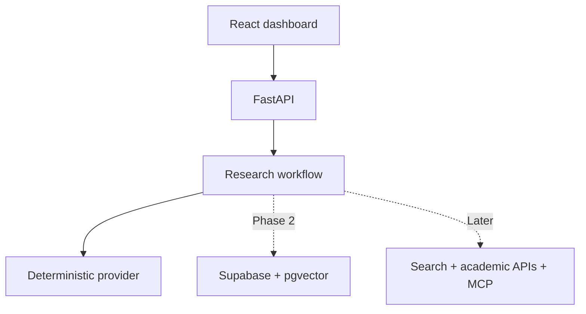

# EvidencePilot AI

> Evidence-first research by coordinated AI agents.

EvidencePilot AI is an agentic research intelligence platform that turns a research question and optional documents into a traceable technical report. It is designed as a visible AI research department: a supervisor plans the work, specialist agents gather evidence, a critic challenges coverage, a fact checker verifies claims, and a report agent produces a referenced deliverable.

This repository is being built by **Huzaifa Waqar Butt** as a production-minded portfolio project covering multi-agent orchestration, tool calling, MCP, PDF RAG, hybrid retrieval, vector databases, memory, evaluation, and deployment.

## Phase 1 foundation

The current foundation includes:

- React, TypeScript, Vite, and a responsive research dashboard.
- Python 3.12, FastAPI, typed schemas, CORS, and versioned API routes.
- A deterministic mock research workflow with supervisor, specialist, critic, fact-checker, and report stages.
- Health/readiness endpoints and recruiter-friendly fallback demo data.
- Frontend and backend unit tests, linting, formatting, Docker, and GitHub Actions CI.
- Provider boundaries ready for Supabase, Gemini, Tavily, arXiv, Crossref, and MCP in later phases.

No API key or paid service is needed for Phase 1.

## Architecture



## Quick start

### Prerequisites

- Python 3.12+
- Node.js 20+
- npm 10+
- [uv](https://docs.astral.sh/uv/)

### Install

```bash
cp .env.example .env
make install
```

### Run both applications

```bash
make dev
```

Open:

- Dashboard: http://localhost:5173
- API: http://localhost:8000
- OpenAPI documentation: http://localhost:8000/docs
- Health check: http://localhost:8000/health

### Validate

```bash
make lint
make test
make build
```

### Docker

```bash
cp .env.example .env
docker compose up --build
```

## API snapshot

| Method | Route | Purpose |
|---|---|---|
| `GET` | `/health` | Liveness and version |
| `GET` | `/ready` | Dependency readiness |
| `GET` | `/api/v1/demo` | Preloaded recruiter workspace |
| `POST` | `/api/v1/research/demo` | Deterministic mock research run |

Example:

```bash
curl -X POST http://localhost:8000/api/v1/research/demo \
  -H "Content-Type: application/json" \
  -d '{"question":"Compare Mamba architectures for object detection","depth":"standard"}'
```

## Roadmap

- **Phase 1:** application foundation and mock vertical slice.
- **Phase 2:** Supabase Auth, PostgreSQL, Storage, pgvector, and Row Level Security.
- **Phase 3:** PDF parsing, chunking, embeddings, hybrid retrieval, and page citations.
- **Phase 4:** single live research-agent baseline and evaluation dataset.
- **Phase 5:** conditional multi-agent orchestration, critique, and fact checking.
- **Phase 6:** complete dashboard, report exports, and public Mamba-YOLO demo.
- **Phase 7:** MCP tools and inspectable project memory.
- **Phase 8:** security evaluation and production deployment.

See [`PROJECT_REQUIREMENTS.md`](PROJECT_REQUIREMENTS.md) for the complete specification and [`docs/architecture.md`](docs/architecture.md) for current design boundaries.

## Security

Never commit real credentials. The browser receives only public configuration. Provider secrets and future Supabase service-role credentials remain backend-only. Public demo content must be non-sensitive.

Please report security concerns using [`SECURITY.md`](SECURITY.md).

## License

MIT License. See [`LICENSE`](LICENSE).
