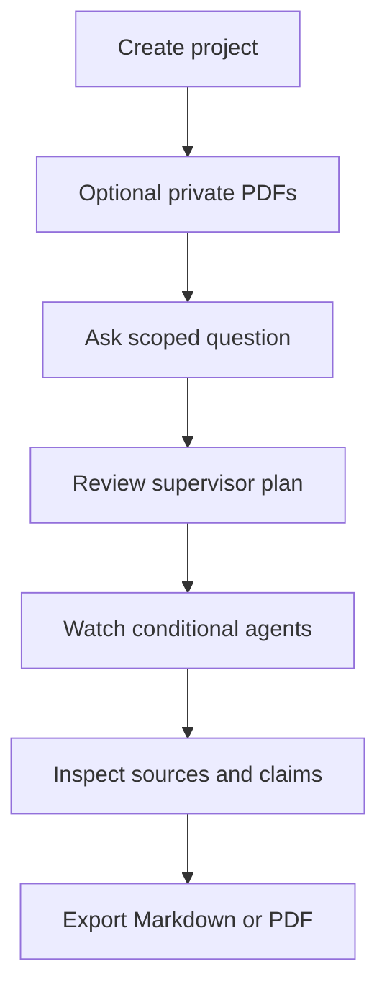

# EvidencePilot AI

> Evidence-first research by coordinated AI agents.

[](https://github.com/Huzaifa-170504/evidencepilot-ai/actions/workflows/ci.yml)
[](https://github.com/Huzaifa-170504/evidencepilot-ai/actions/workflows/security.yml)

EvidencePilot AI is an agentic research intelligence platform built by **Huzaifa Waqar Butt**. It turns a question and optional private PDFs into a traceable technical report using conditional LangGraph agents, function tools, MCP, hybrid PDF RAG, pgvector, memory, criticism, claim verification, and a professional recruiter-facing dashboard.

## What it demonstrates

- Supervisor, Academic, Web, Document, Data Analyst, Critic, Fact Checker, and Report contracts
- Conditional orchestration with fixed budgets and safe event traces
- Supabase Auth, PostgreSQL, private Storage, Realtime, pgvector, and hardened RLS
- PDF signature/page/encryption/checksum validation with page-aware PyMuPDF parsing
- PostgreSQL full-text search + pgvector cosine search + reciprocal-rank fusion
- Stable source IDs, page citations, claim verdicts, limitations, and exports
- arXiv, Crossref, optional Tavily, optional Gemini, and deterministic free fallback
- Read-only `evidencepilot-research-tools` MCP server
- 25-question evaluation dataset, 90%+ backend coverage, CI/CD, Pages, and Render descriptors

## User flow



The cached Mamba-YOLO workspace works without an account or provider key. Authenticated users can create persistent projects and upload PDFs after public Supabase configuration and the backend URL are configured.

## Architecture

| Layer | Technology |
|---|---|
| Frontend | React 19, TypeScript, Vite, Supabase JS |
| API | Python 3.12, FastAPI, Pydantic |
| Orchestration | LangGraph |
| Data | Supabase PostgreSQL, Auth, Storage, Realtime, pgvector |
| RAG | PyMuPDF, pypdf, hashing/Gemini embeddings, FTS + vector RRF |
| Tools | Tavily, arXiv, Crossref, MCP |
| Hosting | GitHub Pages + Render Blueprint |
| Quality | pytest, Ruff, Vitest, ESLint, GitHub Actions |

## Quick start

Prerequisites: Python 3.12+, Node.js 20+, npm 10+, and [uv](https://docs.astral.sh/uv/).

```bash
git clone https://github.com/Huzaifa-170504/evidencepilot-ai.git
cd evidencepilot-ai
cp .env.example .env
make install
make dev
```

Open:

- Dashboard: <http://localhost:5173>
- API docs: <http://localhost:8000/docs>
- Health: <http://localhost:8000/health>

The cached demo requires no key. For Auth and PDF uploads, set the Supabase URL/publishable key in frontend and backend variables. Never expose `SUPABASE_SERVICE_ROLE_KEY`, `GEMINI_API_KEY`, `TAVILY_API_KEY`, or `DATABASE_URL` in a `VITE_*` variable.

## Validate

```bash
make lint
make test
make build
uv run --directory apps/api python ../../evals/runners/evaluate_contracts.py
```

Current deterministic contract baseline:

- 25 evaluation questions
- Zero fabricated source identifiers
- Correct Document/Data Analyst routing
- Critic and Fact Checker included before full reports
- Supabase security advisor: no findings

## Repository map

```text
apps/web/                 React dashboard
apps/api/                 FastAPI, LangGraph, RAG, providers, tests
packages/mcp_server/      Read-only MCP server
packages/*/               Extractable package boundaries
supabase/migrations/      Schema, pgvector, RLS, Storage, hardening
supabase/seed/            Public recruiter seed
evals/                    Dataset, runner, baseline result
docs/                     Architecture, RAG, database, security, deployment
render.yaml               Render Blueprint
.github/workflows/        CI, security, GitHub Pages deployment
```

## Deployment status and owner steps

The Supabase schema, RLS, Storage bucket, pgvector, Realtime, seed, and generated TypeScript types are provisioned for project `dsbxndbbpryisxevjjgc`.

Account-level deployment still requires:

1. Create a Render Blueprint from `render.yaml` and add backend secrets.
2. Add GitHub repository variables `VITE_API_BASE_URL`, `VITE_SUPABASE_URL`, and `VITE_SUPABASE_PUBLISHABLE_KEY`.
3. Select **GitHub Actions** under repository Settings → Pages.
4. Add the final Pages URL to Supabase Auth URL configuration.
5. Optionally configure free Gemini/Tavily keys and enable live provider mode.

Connecting the GitHub repository inside Supabase is optional; environment variables and version-controlled migrations are the actual application connection.

## Documentation

- [Final technical documentation](FINAL_DOCUMENTATION.md)
- [Product requirements](PROJECT_REQUIREMENTS.md)
- [Architecture](docs/architecture.md)
- [Agent contracts](docs/agent-contracts.md)
- [RAG design](docs/rag-design.md)
- [Database and RLS](docs/database.md)
- [Security](docs/security.md)
- [Deployment](docs/deployment.md)
- [Recruiter demo](docs/demo-guide.md)

## Security and privacy

Upload only public or non-sensitive documents to the demo. Retrieved PDFs and webpages are untrusted evidence, not agent instructions. The system stores concise events and rationale summaries rather than private chain-of-thought. See [SECURITY.md](SECURITY.md) for reporting guidance.

## License

MIT — see [LICENSE](LICENSE).
