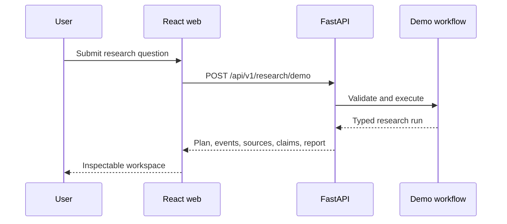

# Architecture

## Phase 1

Phase 1 establishes a provider-independent vertical slice. The frontend submits a research question to FastAPI. A deterministic service returns the same structured research run contract that future LangGraph agents will produce. This lets the dashboard, API contracts, tests, CI, and recruiter experience mature before external services add cost and nondeterminism.

## Stable contracts

- `ResearchRequest`: question and research depth.
- `ResearchRun`: run metadata, status, metrics, plan, events, sources, claims, and report.
- `AgentEvent`: visible agent activity without private chain-of-thought.
- `Source`: canonical evidence identity.
- `Claim`: verification verdict linked to source IDs.

## Next boundary

Phase 2 replaces in-memory mock persistence with Supabase. Route contracts remain stable while repositories implement users, projects, documents, runs, events, sources, claims, and memory with Row Level Security.
