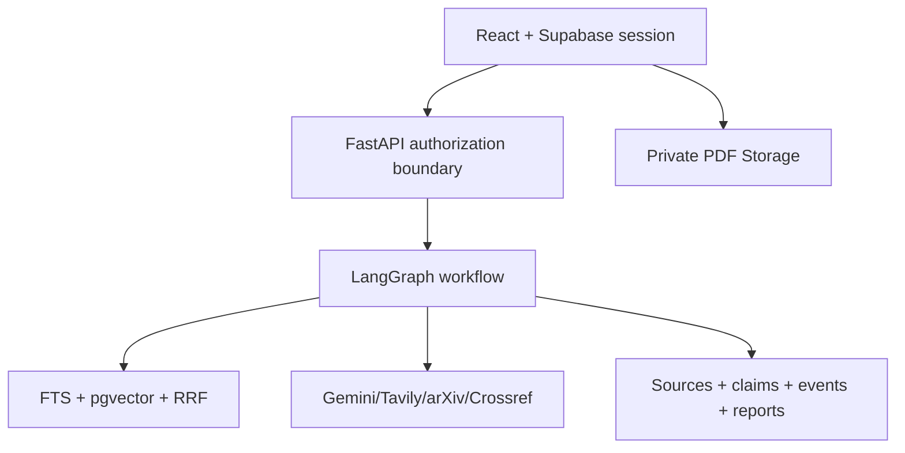

# Architecture

EvidencePilot separates the untrusted static browser, trusted API orchestration, project-scoped Supabase data, and replaceable external providers.

Key decisions:

- GitHub Pages serves only static assets and public configuration.
- The API validates Supabase sessions and forwards user identity to PostgREST so RLS remains authoritative.
- Provider interfaces preserve deterministic fallback and allow model/search replacement.
- Claims reference stored source IDs; unknown IDs fail evaluation.
- Event streams store safe summaries, not hidden chain-of-thought.
- Long-running work persists status and checkpoints in `research_runs`, `agent_tasks`, and `jobs`.

See `FINAL_DOCUMENTATION.md` for the complete operational description.
